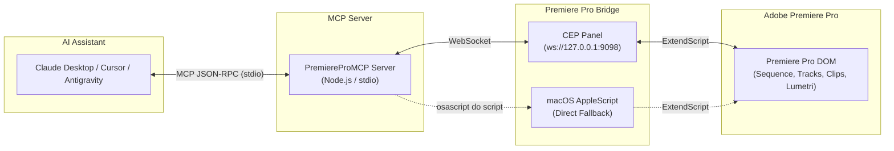

# 🎬 Adobe Premiere Pro MCP Server

A powerful **Model Context Protocol (MCP)** server built in **JavaScript (Node.js)** that connects AI assistants (**Claude, Cursor, Antigravity**) directly to **Adobe Premiere Pro** for natural language video editing automation.

---

## 🌟 Overview & Architecture

Adobe Premiere Pro exposes its internal Document Object Model (DOM) through JavaScript (ExtendScript / CEP / UXP). This server establishes a dual-bridge architecture:

1. **CEP Extension Panel (Recommended / Cross-Platform)**: A lightweight, dark-themed panel inside Premiere Pro communicating with the MCP server over a low-latency local WebSocket (`ws://127.0.0.1:9098`).
2. **macOS AppleScript Fallback**: Zero-configuration instant execution on macOS using `osascript` when the panel is not yet open.



---

## 🛠️ Tool Catalog

### 📁 A. Project & Media Pool Management
* **`get_project_info`**: Inspect active project name, path, sequences count, and active sequence summary.
* **`save_project`**: Save current project changes.
* **`save_as_project`**: Create non-destructive version backups (`.prproj`).
* **`list_bins`**: Recursively retrieve project item hierarchy and bins.
* **`create_bin`**: Create a new bin (folder) in the Project Panel.
* **`delete_bin`**: Delete a bin or project item by name or nodeId.
* **`import_media`**: Ingest video, audio, and image assets into a designated bin.
* **`relink_media`**: Relink missing media or swap placeholders.
* **`get_clip_metadata` / `set_clip_metadata`**: Read and update clip names, color labels (0–15), and XMP metadata.

### 🎬 B. Sequence & Timeline Operations
* **`list_sequences`**: Retrieve all sequences in the project with frame rates, durations, and track counts.
* **`get_sequence_details`**: Fetch active sequence resolution, timebase, duration, and in/out points.
* **`create_sequence`**: Create a new sequence.
* **`duplicate_sequence`**: Clone active sequence to create safe backups before automated edits.
* **`set_playhead_position` / `get_playhead_position`**: Move or query CTI (playhead) position in seconds.
* **`set_in_out_points` / `clear_in_out_points`**: Set or clear In/Out boundaries.

### ✂️ C. Timeline Editing & Clip Manipulation
* **`list_timeline_clips`**: Inspect all clips on video (V1, V2...) and audio (A1, A2...) tracks with start/end timestamps and media paths.
* **`insert_clip`**: Ripple edit insertion of project items at specified timestamps.
* **`overwrite_clip`**: Place clips overwriting timeline content.
* **`razor_clip`**: Split/cut a clip on a track at a specific timestamp (via Premiere QE DOM).
* **`trim_clip`**: Adjust start, end, inPoint, and outPoint of timeline clips.
* **`delete_clip`**: Delete a clip (with optional ripple delete).
* **`enable_disable_clip`**: Mute/hide or enable timeline clips.
* **`track_management`**: Lock/unlock tracks and mute/solo audio tracks.

### 📐 D. Motion, Transform & Keyframing (Inspector)
* **`set_clip_transform`**: Modify `Position` [X, Y], `Scale`, `Scale Width`, `Rotation`, and `Anchor Point`.
* **`set_clip_opacity`**: Adjust clip opacity (0–100%).
* **`add_keyframe`**: Add automated keyframes to parameters for zooms, pans, and fades.

### 🎨 E. Effects & Color Grading (Lumetri)
* **`list_clip_effects`**: List applied effects and properties on a clip.
* **`adjust_effect_parameter`**: Modify effect parameters (e.g. Blurriness, Crop).
* **`apply_lumetri_grade`**: Adjust Lumetri Color grading (Exposure, Contrast, Highlights, Shadows, Whites, Blacks, Saturation, Temperature, Tint).

### 🔊 F. Audio & Essential Sound
* **`set_clip_volume`**: Adjust clip volume levels (e.g. 1.0 = 0dB, 0.5 = -6dB).

### 🔤 G. Essential Graphics & MOGRT
* **`import_mogrt`**: Place Motion Graphics Templates (`.mogrt`) onto timeline.
* **`update_mogrt_text`**: Inject AI-generated title text, speaker names, or lower-thirds.

### 🏷️ H. Markers & Annotations
* **`list_markers`**: Read timeline markers with timestamps, comments, and colors.
* **`add_marker`**: Drop colored markers at specific timestamps.
* **`delete_marker`**: Delete markers by name or timestamp.

### 🚀 I. Export & Render
* **`export_sequence_direct`**: Render sequence directly via an `.epr` preset.
* **`queue_to_media_encoder`**: Push sequence to Adobe Media Encoder for background queue rendering.

### ⚡ J. Compound AI Workflows
* **`batch_razor_cuts`**: Automatically razor cut timeline at silence or speech timestamps.
* **`generate_youtube_chapters`**: Batch generate timeline markers matching AI chapter summaries.
* **`reformat_aspect_ratio`**: Duplicate sequence and prepare vertical 9:16 reframe (Shorts, Reels, TikTok).
* **`execute_extendscript`**: Run raw arbitrary ExtendScript for unlimited extensibility.

---

## 📦 Installation & Setup

### 1. Prerequisites
- **Node.js**: v18.0.0 or higher
- **Adobe Premiere Pro**: 2020 through 2025+

### 2. Install Dependencies
```bash
git clone https://github.com/your-username/PremiereProMCP.git
cd PremiereProMCP
npm install
```

### 3. Install the Premiere Pro Extension Panel
Run the built-in installer to install the CEP extension and enable debug mode:
```bash
npm run install-plugin
```

> **What this does:**
> - Copies `premiere-plugin` to your system CEP directory:
>   - macOS: `~/Library/Application Support/Adobe/CEP/extensions/com.premierepromcp.bridge`
>   - Windows: `%APPDATA%\Adobe\CEP\extensions\com.premierepromcp.bridge`
> - Enables Adobe `PlayerDebugMode 1` so the extension loads seamlessly without code signing.

### 4. Enable the Panel in Premiere Pro
1. Open or restart **Adobe Premiere Pro**.
2. Open your project.
3. In the top menu, go to: **Window > Extensions > Premiere Pro MCP Bridge**.
4. The panel will launch and display connection status with a live activity log.

---

## 🤖 AI Assistant Configuration

### Claude Desktop
Add this to your `claude_desktop_config.json`:
- **macOS**: `~/Library/Application Support/Claude/claude_desktop_config.json`
- **Windows**: `%APPDATA%\Claude\claude_desktop_config.json`

```json
{
  "mcpServers": {
    "premiere-pro": {
      "command": "node",
      "args": ["/Volumes/macos/projects/PremiereProMCP/src/index.js"],
      "env": {
        "PORT": "9098",
        "HOST": "127.0.0.1"
      }
    }
  }
}
```

### Cursor (`.cursor/mcp.json`)
```json
{
  "mcpServers": {
    "premiere-pro": {
      "command": "node",
      "args": ["/Volumes/macos/projects/PremiereProMCP/src/index.js"]
    }
  }
}
```

---

## 🧪 Testing

Run the automated test suite to verify the bridge server and action dispatching:
```bash
npm test
```

---

## 💡 Example Prompts

Once configured in Claude or Cursor, you can ask things like:

* *"What clips are currently on the timeline?"*
* *"Duplicate the active sequence to create a backup, then reformat it to 9:16 for a TikTok vertical video."*
* *"Cut out the silent pause on video track 1 at 14.5 seconds and ripple delete the gap."*
* *"Add a chapter marker at 01:15 titled 'Introduction to MCP'."*
* *"Increase the saturation by 15% and lower exposure by 0.3 on the first clip using Lumetri."*
* *"Import my B-roll folder into a new bin called 'Interviews'."*

---

## 📄 License
MIT
