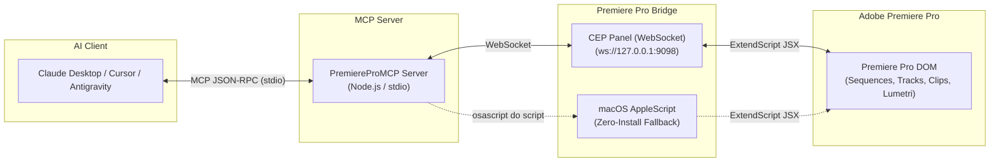

# 🎬 Adobe Premiere Pro MCP Server

<div align="center">

[](https://opensource.org/licenses/MIT)
[](https://nodejs.org/)
[](https://modelcontextprotocol.io/)
[](https://www.adobe.com/products/premiere.html)
[](https://github.com/au-yong/premiere-pro-mcp/pulls)

**Control Adobe Premiere Pro with natural language using Claude, Cursor, and Antigravity.**  
*Automate rough cuts, silence removal, B-roll placement, Lumetri grading, MOGRT titles, chapter markers, and batch exports via the Model Context Protocol.*

[Features](#-key-features) • [Architecture](#-architecture) • [3-Minute Quickstart](#-3-minute-quickstart) • [Tool Catalog](#-complete-tool-catalog) • [AI Client Setup](#-ai-assistant-configuration) • [AI Workflows](#-high-value-compound-ai-workflows) • [Troubleshooting](#-troubleshooting--faq)

</div>

---

## 💡 What is PremiereProMCP?

**PremiereProMCP** is an open-source [Model Context Protocol (MCP)](https://modelcontextprotocol.io/) server written in **JavaScript (Node.js)** that bridges modern LLMs directly to **Adobe Premiere Pro**.

Unlike DaVinci Resolve Studio (which exposes an external Python socket library), Premiere Pro's Document Object Model (DOM) is traditionally confined inside an ExtendScript / CEP runtime. **PremiereProMCP solves this** by establishing a bidirectional loopback bridge between your desktop AI assistant and Premiere Pro:

- 🗣️ **Natural Language Control**: *"Inspect active sequence, split at 12.4s, ripple delete the silence, and add a green chapter marker."*
- ⚡ **Dual Execution Engines**: Low-latency WebSocket bridge via an in-app CEP panel + zero-configuration macOS AppleScript fallback.
- 🛡️ **Non-Destructive by Design**: Includes sequence duplication safety tools before AI makes timeline modifications.
- ⏱️ **Tick-Accurate Timing**: Seamlessly converts seconds to Premiere Pro’s native internal time precision (`254,016,000,000` ticks per second).

---

## 🌟 Key Features

| Domain | Capabilities |
| :--- | :--- |
| **📁 Project & Bins** | Inspect project state, create/organize bins, import video/audio/stills, relink offline media, update XMP metadata. |
| **🎬 Sequence & Timeline** | Read sequence settings (timebase, resolution, fps), duplicate sequences, move playhead, set In/Out points. |
| **✂️ Non-Linear Editing** | Insert clips (ripple), overwrite clips, razor/cut clips (via QE DOM), trim start/end points, ripple-delete clips and gaps. |
| **📐 Motion & Inspector** | Set Position `[X, Y]`, Scale, Rotation, Anchor Point, Opacity, and animate parameters with keyframes. |
| **🎨 Lumetri Color** | Adjust Exposure, Contrast, Highlights, Shadows, Whites, Blacks, Saturation, Temperature, and Tint. |
| **🔊 Audio & Sound** | Adjust clip volume (dB), mute/solo audio tracks, lock/unlock tracks. |
| **🔤 MOGRT & Titles** | Import Motion Graphics Templates (`.mogrt`), programmatically inject AI-generated lower-thirds, titles, and captions. |
| **🏷️ Markers & Chapters** | Query, create, and delete timeline markers; batch generate YouTube chapter markers from transcript summaries. |
| **🚀 Export & Render** | Direct rendering via `.epr` presets, or push sequences to Adobe Media Encoder (AME) batch queues. |

---

## 🏗️ Architecture



### How the Bridge Works
1. **The MCP Server (`src/index.js`)** runs locally as a Node.js process using standard I/O (`stdio`).
2. **The In-App Extension Panel (`premiere-plugin/`)** runs inside Premiere Pro. On launch, it connects to the local WebSocket server (`ws://127.0.0.1:9098`).
3. When your AI assistant asks to perform an action (e.g. `razor_clip`), the server sends a structured JSON payload to the panel, which executes the corresponding Premiere Pro ExtendScript call and returns the result back to the LLM.
4. **macOS Fallback**: If the extension panel is not open, the server can automatically execute ExtendScript directly via AppleScript (`osascript -e 'tell application "Adobe Premiere Pro" to do script ...'`).

---

## 🚀 3-Minute Quickstart

### Step 1: Clone and Install Dependencies

```bash
git clone https://github.com/au-yong/premiere-pro-mcp.git
cd premiere-pro-mcp
npm install
```

### Step 2: Install the Premiere Pro Extension Panel

Run the automated installer script:

```bash
npm run install-plugin
```

> [!NOTE]
> **What this does automatically:**
> - Copies the panel to your OS extension directory:
>   - **macOS**: `~/Library/Application Support/Adobe/CEP/extensions/com.premierepromcp.bridge`
>   - **Windows**: `%APPDATA%\Adobe\CEP\extensions\com.premierepromcp.bridge`
> - Enables Adobe `PlayerDebugMode 1` so unsigned development extensions load cleanly.

### Step 3: Open the Extension in Premiere Pro

1. Launch **Adobe Premiere Pro** (2020 through 2025+).
2. Open any video project.
3. In the top application menu, select:
   **Window** ➔ **Extensions** ➔ **Premiere Pro MCP Bridge**
4. A sleek dark panel will open and show **`Connected`** to `ws://127.0.0.1:9098`.

### Step 4: Test the Bridge Connection

Verify the end-to-end connection by running the test suite:

```bash
npm test
```

---

## 🤖 AI Assistant Configuration

Configure your favorite AI assistant to launch PremiereProMCP via stdio.

### Claude Desktop

Edit your Claude Desktop configuration file:
- **macOS**: `~/Library/Application Support/Claude/claude_desktop_config.json`
- **Windows**: `%APPDATA%\Claude\claude_desktop_config.json`

```json
{
  "mcpServers": {
    "premiere-pro": {
      "command": "node",
      "args": ["/ABSOLUTE/PATH/TO/PremiereProMCP/src/index.js"],
      "env": {
        "PORT": "9098",
        "HOST": "127.0.0.1"
      }
    }
  }
}
```

### Cursor IDE

Create or update `.cursor/mcp.json` in your workspace or global settings:

```json
{
  "mcpServers": {
    "premiere-pro": {
      "command": "node",
      "args": ["/ABSOLUTE/PATH/TO/PremiereProMCP/src/index.js"]
    }
  }
}
```

### Google Antigravity / Gemini CLI

In your Antigravity or MCP client configuration:

```json
{
  "mcpServers": {
    "premiere-pro": {
      "command": "node",
      "args": ["/ABSOLUTE/PATH/TO/PremiereProMCP/src/index.js"]
    }
  }
}
```

---

## 🛠️ Complete Tool Catalog

PremiereProMCP exposes **over 30 tools** organized across video editing domains:

### 1. Project & Media Pool Management

| Tool | Parameters | Description |
| :--- | :--- | :--- |
| `get_project_info` | None | Read active project name, path, sequence counts, and active sequence summary. |
| `save_project` | None | Save the active project. |
| `save_as_project` | `filePath` | Save project copy (great for non-destructive versioning). |
| `list_bins` | None | Traverse and return full hierarchy of bins and media items in the Project panel. |
| `create_bin` | `name`, `parentPath` (opt) | Create a new bin/folder inside the Project panel. |
| `delete_bin` | `name` or `nodeId` | Delete a bin or media item from the project. |
| `import_media` | `filePaths` (array), `targetBinPath` (opt) | Ingest video, audio, or graphics files into a specific bin. |
| `relink_media` | `newMediaPath`, `clipName` or `nodeId` | Relink offline footage or swap a placeholder clip. |
| `get_clip_metadata` | `clipName` or `nodeId` | Read clip properties, media file path, color label, and XMP metadata. |
| `set_clip_metadata` | `clipName`, `colorLabel` (0–15), `name` (opt) | Set clip name, color label, or XMP metadata. |

### 2. Sequence & Timeline Operations

| Tool | Parameters | Description |
| :--- | :--- | :--- |
| `list_sequences` | None | List all sequences in the project with durations, timebases, and track counts. |
| `get_sequence_details` | `sequenceName` (opt) | Detailed sequence properties (width, height, fps, timebase, duration, in/out). |
| `create_sequence` | `name`, `sequenceID` (opt) | Create a new sequence in the project. |
| `duplicate_sequence` | `sequenceName` (opt), `newName` (opt) | **Safety tool**: Duplicate active sequence before AI performs edits. |
| `set_playhead_position` | `seconds` | Move the CTI (playhead) to a precise timestamp in seconds. |
| `get_playhead_position` | None | Query current playhead position in seconds and ticks. |
| `set_in_out_points` | `inSeconds` (opt), `outSeconds` (opt) | Set Mark In and Mark Out boundaries. |
| `clear_in_out_points` | None | Clear Mark In and Out points on the sequence. |

### 3. Timeline Editing & Clip Manipulation

| Tool | Parameters | Description |
| :--- | :--- | :--- |
| `list_timeline_clips` | None | List all clips across video (V1, V2...) and audio (A1, A2...) tracks with timestamps. |
| `insert_clip` | `clipName`, `trackType`, `trackIndex`, `timeSeconds` | Ripple edit insertion of a project item into the timeline. |
| `overwrite_clip` | `clipName`, `trackType`, `trackIndex`, `timeSeconds` | Place a project item overwriting existing content at timestamp. |
| `razor_clip` | `timeSeconds`, `trackType`, `trackIndex` | Split a clip at a timestamp using Premiere's QE DOM. |
| `trim_clip` | `trackIndex`, `clipIndex`, `startSeconds`, `endSeconds` | Adjust start, end, inPoint, or outPoint of an existing timeline clip. |
| `delete_clip` | `trackIndex`, `clipIndex`, `rippleDelete` (bool) | Remove clip from timeline (optionally ripple delete to close gap). |
| `enable_disable_clip` | `trackIndex`, `clipIndex`, `enabled` (bool) | Mute/hide or unmute a clip on the timeline. |
| `track_management` | `trackIndex`, `trackType`, `locked`, `muted`, `solo` | Lock/unlock tracks and mute/solo audio tracks. |

### 4. Motion, Transform & Keyframing (Inspector)

| Tool | Parameters | Description |
| :--- | :--- | :--- |
| `set_clip_transform` | `position` [X, Y], `scale`, `rotation`, `anchorPoint` | Set clip Motion properties (e.g. reframing or zooming). |
| `set_clip_opacity` | `trackIndex`, `clipIndex`, `opacity` (0–100) | Adjust clip opacity percentage. |
| `add_keyframe` | `componentName`, `propertyName`, `timeSeconds`, `value` | Add keyframes to parameters for zooms, pans, and fades. |

### 5. Effects & Color Grading (Lumetri)

| Tool | Parameters | Description |
| :--- | :--- | :--- |
| `list_clip_effects` | `trackIndex`, `clipIndex` | List all effects and components applied to a clip with parameters. |
| `adjust_effect_parameter` | `effectName`, `parameterName`, `value` | Modify an effect parameter (e.g. Blurriness on Gaussian Blur). |
| `apply_lumetri_grade` | `exposure`, `contrast`, `highlights`, `shadows`, `whites`, `blacks`, `saturation`, `temperature`, `tint` | Programmatically adjust Lumetri Color grading on a clip. |

### 6. Audio, Graphics & Markers

| Tool | Parameters | Description |
| :--- | :--- | :--- |
| `set_clip_volume` | `trackIndex`, `clipIndex`, `volumeLevel` | Adjust clip audio volume (e.g. 1.0 = 0dB, 0.5 = -6dB). |
| `import_mogrt` | `mogrtPath`, `timeSeconds`, `videoTrackIndex` | Drop a Motion Graphics Template (`.mogrt`) onto the timeline. |
| `update_mogrt_text` | `trackIndex`, `clipIndex`, `textValue`, `propertyName` | Inject AI-generated title text, speaker names, or lower-thirds. |
| `list_markers` | None | Read all sequence markers with timestamps and comments. |
| `add_marker` | `timeSeconds`, `name`, `comments`, `colorIndex` | Drop colored markers (for AI cut notes, beat matching, chapter points). |
| `delete_marker` | `name` or `timeSeconds` | Remove marker from sequence. |

### 7. Export & Render

| Tool | Parameters | Description |
| :--- | :--- | :--- |
| `export_sequence_direct` | `outputPath`, `presetPath` (opt), `workAreaType` | Render sequence directly using an Adobe preset (`.epr`). |
| `queue_to_media_encoder` | `outputPath`, `presetPath` (opt) | Push sequence to Adobe Media Encoder for background batch rendering. |

### 8. Compound AI Workflows & Utilities

| Tool | Parameters | Description |
| :--- | :--- | :--- |
| `batch_razor_cuts` | `timestampsSeconds` (array), `trackIndex` | Perform sequential cuts at silence timestamps or beat markers. |
| `generate_youtube_chapters` | `chapters` `[{ timestampSeconds, title, description }]` | Create formatted YouTube chapter markers across the sequence. |
| `reformat_aspect_ratio` | `aspectRatio` ("9:16", "1:1", "16:9"), `nameSuffix` | Duplicate sequence and prepare vertical reframe for TikTok/Shorts. |
| `verify_connection` | None | Inspect bridge status, latency, and connected Premiere client info. |
| `execute_extendscript` | `jsxCode` | Execute raw arbitrary ExtendScript for unlimited DOM extensibility. |

---

## ⚡ High-Value Compound AI Workflows

Here is how you can use natural language to trigger compound video editing workflows:

### 1. The Auto-Silence Rough-Cutter
> **Prompt**: *"Analyze the audio on my active sequence. I want you to duplicate the sequence for safety, split clip at [04.2s, 08.5s, 14.1s], and ripple-delete the pauses."*
1. AI calls `duplicate_sequence(newName: "Rough_Cut_Backup")`.
2. AI calls `batch_razor_cuts(...)` at the silence boundary timestamps.
3. AI calls `delete_clip(rippleDelete: true)` to close the gaps into a punchy jump-cut.

### 2. YouTube Smart Chapter Generator
> **Prompt**: *"Based on this script outline, place chapter markers on the timeline: 00:00 Intro, 01:25 Setup, 04:10 Demo, 08:30 Conclusion."*
- AI calls `generate_youtube_chapters(...)` which automatically calculates tick positions and drops named, color-coded markers directly onto the timeline.

### 3. Vertical Shorts / Reels 9:16 Reformatter
> **Prompt**: *"Create a 9:16 vertical version of my sequence for Instagram Reels, and scale the talking head by 150%."*
1. AI calls `reformat_aspect_ratio(aspectRatio: "9:16")`.
2. AI calls `set_clip_transform(scale: 150, position: [540, 960])` to frame the presenter perfectly.

### 4. AI Lower-Third & Title Injector
> **Prompt**: *"Add the speaker lower-third 'Dr. Jane Smith - Lead AI Scientist' at 00:15 using my brand template."*
1. AI calls `import_mogrt(mogrtPath: "/templates/lower_third.mogrt", timeSeconds: 15.0)`.
2. AI calls `update_mogrt_text(textValue: "Dr. Jane Smith\nLead AI Scientist")`.

---

## 🔍 Troubleshooting & FAQ

<details>
<summary><b>Q: The extension panel doesn't show under Window &gt; Extensions?</b></summary>

1. Ensure you ran `npm run install-plugin`.
2. Restart Adobe Premiere Pro completely (Premiere only scans the `CEP/extensions` folder at startup).
3. If on macOS, verify PlayerDebugMode was set:
   ```bash
   defaults read com.adobe.CSXS.11 PlayerDebugMode
   # Should output: 1
   ```
</details>

<details>
<summary><b>Q: How do I change the default port (9098)?</b></summary>

Create or update `.env` in the root of `PremiereProMCP`:
```env
PORT=9100
HOST=127.0.0.1
```
And make sure the same URL (`ws://127.0.0.1:9100`) is entered in the panel settings input inside Premiere Pro.
</details>

<details>
<summary><b>Q: What Premiere Pro versions are supported?</b></summary>

PremiereProMCP supports **Adobe Premiere Pro 2020 through 2025+** (internal versions 13.0 through 99.0). It runs on both **macOS (Apple Silicon & Intel)** and **Windows 10/11**.
</details>

<details>
<summary><b>Q: Why does the panel log show QE DOM enabled?</b></summary>

Premiere Pro's standard public DOM does not expose a native `clip.razor()` method. To cut clips programmatically without third-party plugins, PremiereProMCP enables the QE (Quality Engineering) DOM (`app.enableQE()`), which is standard practice in professional Premiere Pro automation.
</details>

---

## 🛠️ Project Structure

```
PremiereProMCP/
├── src/
│   ├── index.js                  # Main MCP Server entry point (stdio)
│   ├── config.js                 # Environment config & constants
│   ├── bridge/
│   │   ├── bridge-manager.js     # Unified execution dispatcher
│   │   ├── websocket-bridge.js   # Real-time WebSocket server (ws://)
│   │   ├── applescript-bridge.js # macOS osascript fallback
│   │   ├── extendscript-helpers.js # JSON2 polyfill & tick math
│   │   └── extendscript-templates.js # DOM execution templates
│   ├── tools/                    # Modular MCP tools by category
│   │   ├── project-tools.js
│   │   ├── sequence-tools.js
│   │   ├── editing-tools.js
│   │   ├── inspector-tools.js
│   │   ├── effects-tools.js
│   │   ├── audio-tools.js
│   │   ├── graphics-tools.js
│   │   ├── marker-tools.js
│   │   ├── export-tools.js
│   │   ├── compound-tools.js
│   │   └── system-tools.js
│   └── resources/
│       └── index.js              # Live URI resources
├── premiere-plugin/              # CEP Extension Panel
│   ├── CSXS/manifest.xml         # Adobe CEP Extension manifest
│   ├── index.html                # Dark-themed status & log panel UI
│   ├── js/
│   │   ├── CSInterface.js        # Adobe CSInterface library
│   │   └── main.js               # WebSocket client & action runner
│   └── jsx/
│       └── hostscript.jsx        # ExtendScript host engine
├── scripts/
│   └── install-plugin.js         # One-command installer
├── test/
│   └── test-server.js            # Automated integration tests
└── package.json
```

---

## 🤝 Contributing

Contributions are very welcome! If you'd like to add new tools (such as multicam switching, transcript parsing, or Essential Sound auto-ducking):

1. Fork the repository.
2. Create a feature branch: `git checkout -b feature/amazing-feature`.
3. Test your changes with `npm test`.
4. Commit and open a Pull Request.

---

## 📄 License

This project is licensed under the **MIT License** - see the [LICENSE](LICENSE) file for details.
